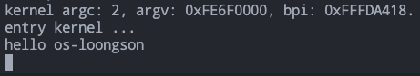

# 2 龙芯启动，向内核迈进

### 龙芯启动部分程序，向内核迈进

从计算机的启动到执行C语言程序大致流程为：1.计算机上电 `->` 2.运行 ROM 程序（BIOS、UEFI） `->` 3.从 ROM 程序接管计算机控制，进行初步设置 `->` 4.运行 C 语言程序。这其中内核编程人员从第 3 步开始需要编写程序，且这部分代码基本上为直接操作寄存器进行设置，所以一般使用汇编代码编写。当对计算机进行内核所需的初始化之后，跳转到 C 语言程序部分开始执行后续内容。后续内容中一般只有少部分代码需要直接操作寄存器，所以后续直接操作寄存器的内容一般使用内敛汇编完成。

> 如果后续内容中存在需要大量操作寄存器的部分，也会直接编写汇编程序。例如例外和中断处理、上下文切换。

本章龙芯启动部分程序的内容为：从ROM程序开始接管计算机控制，进行初步设置，然后跳转至C语言程序。C语言程序中使用串口输出功能，输出`hello os-loongson`。

### 2.1 龙芯启动

上面提到的计算机启动大致流程中，第 3 步的一个作用是为内核提供一个确定性的状态，方便内核管理计算机。为了给内核提供确定性的状态，所以要设置很多系统寄存器和通用寄存器，就会用到汇编语言。为了先体验一下在龙芯架构上的开发，使用最简单的方法看到执行效果。这里先简化这个过程，不进行这个第 3 步的初始化。计算机上电、运行 ROM 程序之后，写一个简单的串口输出程序的 C 语言程序，直接输出 `hello loongson` 字符串。

> 可参考 [https://github.com/huloves/os-loongson](https://github.com/huloves/os-loongson) 的 ch2-1 分支

修改 os-loongson/os-elephant-dev/kernel/init.c 文件内容：

```c
/* os-loongson/os-elephant-dev/kernel/init.c */
// #include "init.h"
// #include "print.h"
// #include "interrupt.h"
// #include "timer.h"
// #include "memory.h"
// #include "thread.h"
// #include "console.h"
// #include "keyboard.h"
// #include "tss.h"
// #include "syscall-init.h"
// #include "ide.h"
// #include "fs.h"

unsigned long uart_base = 0x1fe001e0;   // UART0 寄存器物理地址基址

#define UART0_THR  (uart_base + 0)   // 数据传输寄存器
#define UART0_LSR  (uart_base + 5)   // 线路状态寄存器
#define LSR_TX_IDLE  (1 << 5)	     // 传输 FIFO 位空表示位，为 1 表示可以传输

static char io_readb(unsigned long addr)
{
	return *(volatile char*)addr;
}

static void io_writeb(unsigned long addr, char c)
{
	*(char*)addr = c;
}

static void putc(char c)
{
	// wait for Transmit Holding Empty to be set in LSR.
	while((io_readb(UART0_LSR) & LSR_TX_IDLE) == 0);
	io_writeb(UART0_THR, c);
}

static void puts(char *str)
{
	while (*str != 0) {
		putc(*str);
		str++;
	}
}

/* 负责初始化所有模块 */
void init_all()
{
	puts("hello os-loongson\n");
	while(1);
	// put_str("init_all\n");
	// idt_init();	     // 初始化中断
	// mem_init();	     // 初始化内存管理系统
	// thread_init();    // 初始化线程相关结构
	// timer_init();     // 初始化PIT
	// console_init();   // 控制台初始化最好放在开中断之前
	// keyboard_init();  // 键盘初始化
	// tss_init();       // tss初始化
	// syscall_init();   // 初始化系统调用
	// intr_enable();    // 后面的ide_init需要打开中断
	// ide_init();	     // 初始化硬盘
	// filesys_init();   // 初始化文件系统
}
```

暂时注释掉原有的代码，新增的代码就是串口输出的一个简单实现。上面代码中涉及的知识点和与 x86 架构 os-elephant-dev 的不同点：

* 外设IO端口编址方式：统一编址、独立编址。
* 串口以及读写串口的方法。
* x86 架构 os-elephant-dev 在启动后输出字符为访问 0xb8000 起始的显存。

创建 os-loongson/os-elephant-dev/script 目录，然后在该目录下创建一个名为 kernel.ld 的文件。

```bash
os-loongson/os-elephant-dev$ mkdir script
os-loongson/os-elephant-dev$ cd script
os-loongson/os-elephant-dev/script$ touch kernel.ld
```

kernel.ld 的内容涉及链接脚本的知识，推荐博客及官方文档：

* 博客：[https://www.cnblogs.com/jianhua1992/p/16852784.html](https://www.cnblogs.com/jianhua1992/p/16852784.html)
* 官方文档：[https://sourceware.org/binutils/docs/ld/index.html#SEC\_Contents](https://sourceware.org/binutils/docs/ld/index.html#SEC\_Contents)

kernel.ld 文件的内容如下：

```c
ENTRY(init_all)   /* 设置入口点 */
SECTIONS
{
        . = 0x0000000000200000;
	_start = .;
        .head.text : {
                KEEP(*(.head.text))
        }
	.text : {
		*(.text)
		. = ALIGN(4096);
	}
	.data : {
                __start_init_task = .;
                init_thread_union = .; 
                init_stack = .;
                . = __start_init_task + 0x00004000;
		*(.data)
		*(.rodata)
		. = ALIGN(8192);
	}
        __bss_start = .;
	.bss : {
		*(.bss)
		. = ALIGN(4096);
	}
        __bss_stop = .;
	.stab : {
		*(.stab)
		. = ALIGN(8192);
	}
	.data.init_task : {
                *(.data.init_task)
                . = ALIGN(8192);
        }
	_end = .;
}
```

> 为什么这里把起始地址安排在 0x0000000000200000 ？
>
> 参阅文档 loongson\_devsys\_firmware\_kernel\_interface\_specification\_v2.2.pdf 第 4 节。
>
> 该文档下载地址：[https://github.com/loongson-community/docs/blob/master/firmware/loongson\_devsys\_firmware\_kernel\_interface\_specification\_v2.2.pdf](https://github.com/loongson-community/docs/blob/master/firmware/loongson\_devsys\_firmware\_kernel\_interface\_specification\_v2.2.pdf)

修改 os-loongson/os-elephant-dev/makefile 文件，修改为如下内容：

```makefile
BUILD_DIR = ./build
CROSS_COMPILE = ../toolchains/cross-tools/bin/loongarch64-unknown-linux-gnu-
AS = $(CROSS_COMPILE)as
CC = $(CROSS_COMPILE)gcc
LD = $(CROSS_COMPILE)ld
CFLAGS = -Wall -g -march=loongarch64 -mabi=lp64s -ffreestanding -fno-common -nostdlib -fno-stack-protector -fno-pie -no-pie -c -I ./include/
AFLAGS = -nostdinc -D__ASSEMBLY__ -fno-PIE -mabi=lp64s -G0 -pipe -msoft-float -mexplicit-relocs -ffreestanding -mno-check-zero-division -c -I ./include/
LDFLAGS = -m elf64loongarch --no-warn-rwx-segments -G0 -n -nostdlib 

OBJS = $(BUILD_DIR)/init.o

$(BUILD_DIR)/init.o: kernel/init.c
	$(CC) $(CFLAGS) $< -o $@

$(BUILD_DIR)/kernel.elf: $(OBJS)
	$(LD) $(LDFLAGS) -T ./script/kernel.ld $^ -o $@

clean:
	cd $(BUILD_DIR) && rm -rf ./* && if [ -e hd*.img  ];then rm ../*.img;fi

build_dir:
	mkdir -p $(BUILD_DIR)

build: $(BUILD_DIR)/kernel.elf

all: build_dir clean build
```

在 os-loongson/os-elephant-dev/ 目录下执行 make all 进行编译链接：

```bash
os-loongson/os-elephant-dev$ make all
```

在 os-loongson/qemu/ 目录下执行下述命令运行：

```bash
os-loongson/qemu$ ./qemu-system-loongarch64 -m 4G -smp 1 -bios ./loongarch_bios_0310_debug.bin -vga none -nographic -kernel ../os-elephant-dev/build/kernel.elf
```

运行截图如下所示：

<figure><figcaption><p>图 2.1 串口输出运行截图</p></figcaption></figure>

### 2.2 内核初始化，提供确定性状态

内核在刚开始运行时需要一些确定性的设置，包括运行在哪个特权等级下、内存地址访问方式。这里会涉及龙芯架构的内容：

* 特权等级
* MMU 支持的两种虚实地址翻译模式
* 访问存储类型
* 控制状态寄存器（CSR）

#### 2.2.1 特权等级

龙芯架构中处理器核分为 4 个特权等级（Privilege LeVel，简称 PLV），分别是 PLV0\~PLV3。所有特权等级中，PLV0 是具有最高权限的特权等级，也是唯一可以使用特权指令并访问所有特权资源的特权等级。

> 所有特权指令仅在 PLV0 特权等级下才能访问。仅有一个例外情况，当 CSR.MISC 中的 RPCNTL1、RPCNTL2、RPCNTL3 配置为 1 时，可以在 PLV1、PLV2、PLV3 特权等级下执行 CSRRD 指令读取性 能计数器。

#### 2.2.2 虚实地址翻译模式

虚实地址翻译模式分为**直接地址翻译模式**和**映射地址翻译模式**。映射地址翻译模式分为**直接映射地址翻译模式**（简称“直接映射模式”）和**页表映射地址翻译模式**（页表映射模式）。

直接映射配置窗口（DMW0\~DMW3），这一组寄存器参与完成直接映射地址翻译模式。

<table data-full-width="false"><thead><tr><th width="103" align="center">位</th><th width="106" align="center">名字</th><th width="93" align="center">读写</th><th align="center">描述</th></tr></thead><tbody><tr><td align="center">0</td><td align="center">PLV0</td><td align="center">RW</td><td align="center">为 1 表示在特权等级 PLV0 下可以使用该窗口的配置进行直接映射地址翻译。</td></tr><tr><td align="center">1</td><td align="center">PLV1</td><td align="center">RW</td><td align="center">为 1 表示在特权等级 PLV1 下可以使用该窗口的配置进行直接映射地址翻译。</td></tr><tr><td align="center">2</td><td align="center">PLV2</td><td align="center">RW</td><td align="center">为 1 表示在特权等级 PLV2 下可以使用该窗口的配置进行直接映射地址翻译。</td></tr><tr><td align="center">3</td><td align="center">PLV3</td><td align="center">RW</td><td align="center">为 1 表示在特权等级 PLV3 下可以使用该窗口的配置进行直接映射地址翻译。</td></tr><tr><td align="center">5:4</td><td align="center">MAT</td><td align="center">RW</td><td align="center">虚地址落在该映射窗口下访存操作的存储访问类型。</td></tr><tr><td align="center">59:6</td><td align="center">0</td><td align="center">R0</td><td align="center">保留域。读返回 0，且软件不允许改变其值。</td></tr><tr><td align="center">63:60</td><td align="center">VSEG</td><td align="center">RW</td><td align="center">直接映射窗口虚地址的 [63:60] 位。</td></tr></tbody></table>

#### 2.2.3 存储访问类型

龙芯架构下支持三种存储访问类型，分别是：一致可缓存（Coherent Cached，简 称 CC）、强序非缓存（Strongly-ordered UnCached，简称 SUC）和弱序非缓存（Weakly-ordered UnCached， 简称 WUC）。

当处理器核 MMU 处于映射地址翻译模式时，存储访问类型的确定分为两种情况。如果取指或 load/store 操作的地址落在某个**直接映射配置窗口**上，那么该取指或 load/store 操作的存储访问类型由配置该窗口的 CSR 寄存器中的 MAT 域决定。如果取指或 load/store 只能**通过页表完成映射**，那么其存储访问类型由页表 项中的 MAT 域决定。MAT 域的值和存储访问类型之间的关系如下表所示：

| MAT 值 | 存储访问类型 |
| :---: | :----: |
|   0   |  强序非缓存 |
|   1   |  一致可缓存 |
|   2   |  弱序非缓存 |
|   3   |   保留   |

> 龙芯架构参考手册卷一，2.1.7节到2.1.9节详细介绍龙芯架构的存储访问类型。

#### 2.2.4 控制状态寄存器（CSR）

特权资源中非常重要的是控制状态寄存器，控制状态寄存器控制着系统的状态。控制状态寄存器拥有独立的空间，在龙芯架构参考手册中的第 7.1 节中有控制状态寄存器的地址及其名称。访问控制状态寄存器使用 csrrd 指令、csrwr 指令和 csrchg 指令。在后面遇到某一个控制状态寄存器时再展开讲述其内容。
