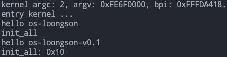

# 3 完善输出功能

到目前为止，已经进入到内核中，实现了一个简单的串口输出功能，可以打印字符串。不过上一章是为了演示进入内核后有所输出，所以为了快速看到运行效果，实现的简单。本章会完善串口驱动并实现 printk 函数，以方便打印。

### 3.1 串口驱动

龙芯 3A5000 处理器使用的串口在寄存器与功能上兼容 NS16550A，有关串口的详细信息查看官方文档《龙芯3A5000\_3B5000处理器寄存器使用手册》的 15.1 节。

在微机原理中，外设通过控制器访问，控制器常见的有控制寄存器、数据寄存器和状态寄存器。串口设备作为一个外设，操作系统操作串口设备控制器对其进行设置和访问，这些外设控制器的寄存器有时有称为端口。关于端口的编址之前已经提到过，龙芯 3A5000 使用的是统一编址。统一编址中对端口的访问就是直接访存。这里首先实现对端口的访问函数，实现中直接访问内存，代码如下：

```c
/* os-loongson/os-elephant-dev/include/io.h */
#ifndef _IO_H
#define _IO_H

#include <stdint.h>   // 声明 [u]int8[16,32,64]_t

static inline uint8_t __raw_readb(const volatile void *addr)
{
	return *(const volatile uint8_t *)addr;
}

static inline uint16_t __raw_readw(const volatile void *addr)
{
	return *(const volatile uint16_t *)addr;
}

static inline uint32_t __raw_readl(const volatile void *addr)
{
	return *(const volatile uint32_t *)addr;
}

static inline uint64_t __raw_readq(const volatile void *addr)
{
	return *(const volatile uint64_t *)addr;
}

static inline void __raw_writeb(uint8_t value, volatile void *addr)
{
	*(volatile uint8_t *)addr = value;
}

static inline void __raw_writew(uint16_t value, volatile void *addr)
{
	*(volatile uint16_t *)addr = value;
}

static inline void __raw_writel(uint32_t value, volatile void *addr)
{
	*(volatile uint32_t *)addr = value;
}

static inline void __raw_writeq(uint64_t value, volatile void *addr)
{
	*(volatile uint64_t *)addr = value;
}

#ifndef readb
#define readb readb
static inline uint8_t readb(const volatile void *addr)
{
	uint8_t val;

	val = __raw_readb((void *)addr);
	return val;
}
#endif

#if !defined(inb) && !defined(_inb)
#define _inb _inb
static inline uint8_t _inb(unsigned long addr)
{
	uint8_t val;

	val = __raw_readb((void *)addr);

	return val;
}
#endif

#if !defined(inw) && !defined(_inw)
#define _inw _inw
static inline uint16_t _inw(unsigned long addr)
{
	uint16_t val;

	val = __raw_readw((void *)addr);
	return val;
}
#endif

#if !defined(inl) && !defined(_inl)
#define _inl _inl
static inline uint32_t _inl(unsigned long addr)
{
	uint32_t val;

	val = __raw_readl((void *)addr);
	return val;
}
#endif

#if !defined(outb) && !defined(_outb)
#define _outb _outb
static inline void _outb(uint8_t value, unsigned long addr)
{
	__raw_writeb(value, (void *)addr);
}
#endif

#if !defined(outw) && !defined(_outw)
#define _outw _outw
static inline void _outw(uint16_t value, unsigned long addr)
{
	__raw_writew(value, (void *)addr);
}
#endif

#if !defined(outl) && !defined(_outl)
#define _outl _outl
static inline void _outl(uint32_t value, unsigned long addr)
{
	__raw_writel(value, (void *)addr);
}
#endif

#ifndef inb
#define inb _inb
#endif

#ifndef inw
#define inw _inw
#endif

#ifndef inl
#define inl _inl
#endif

#ifndef outb
#define outb _outb
#endif

#ifndef outw
#define outw _outw
#endif

#ifndef outl
#define outl _outl
#endif

#endif /* _IO_H */
```

完成端口的访问函数后，实现串口驱动，代码如下：

```c
/* os-loongson/os-elephant-dev/include/ns16550a.h */
#ifndef _NS16550A_H
#define _NS16550A_H

#include <stdint.h>

#define UART_BASE_ADDR	0x1fe001e0

/* 串口寄存器偏移地址 */
#define UART_RX      0       // 接收数据寄存器
#define UART_TX      0       // 发送数据寄存器
#define UART_IER     1       // 中断使能寄存器
#define UART_IIR     2       // 中断状态寄存器
#define UART_LCR     3       // 线路控制寄存器
#define UART_MCR     4       // 调制解调器控制寄存器
#define UART_LSR     5       // 线路状态寄存器
#define UART_MSR     6       // 调制解调器状态寄存器
#define UART_SR      7       // Scratch Register

#define UART_DIV_LATCH_LOW  0   // 分频锁存器1
#define UART_DIV_LATCH_HIGH 1   // 分频锁存器2

/* 线路控制寄存器 (LCR) */
#define UART_LCR_DLAB  0x80  // Divisor Latch Bit

/* 线路状态寄存器 (LSR) */
#define UART_LSR_DR   0x01   // Data Ready
#define UART_LSR_THRE 0x20   // Transmit Holding Register Empty

/* 初始化串口设备 */
void serial_ns16550a_init(uint32_t baud_rate);

/* 发送一个字符 */
void serial_ns16550a_putc(char c);

/* 接收一个字符 */
char serial_ns16550a_getc(void);

/* 发送一个字符串 */
void serial_ns16550a_puts(char *str);

void put_str(char *str);

#endif /* _NS16550A_H */
```

```c
/* os-loongson/os-elephant-dev/device/ns16550a.c */
#include <ns16550a.h>
#include <io.h>

/* 波特率计算公式：Baud = Clock / (16 * Divisor) */
uint16_t divisor = 0;       // 用于存储波特率分频系数

/* 初始化串口设备 */
static void real_serial_ns16550a_init(uint64_t base_addr, uint32_t baud_rate)
{
	uint16_t divisor_value = 0;
   	uint8_t lcr_value = 0;

	/* 计算波特率分频系数 */
	divisor_value = 115200 / baud_rate;
	divisor = divisor_value;

	/* 禁用中断 */
	outb(0x00, base_addr + UART_IER);

	/* 设置波特率 */
	lcr_value = inb(base_addr + UART_LCR);
	outb(lcr_value | UART_LCR_DLAB, base_addr + UART_LCR);
	outb(divisor_value & 0xff, base_addr + UART_DIV_LATCH_LOW);
	outb((divisor_value >> 8) & 0xff, base_addr + UART_DIV_LATCH_HIGH);
	outb(lcr_value, base_addr + UART_LCR);

	/* 设置数据位、停止位、校验位等参数 */
	outb(0x03, base_addr + UART_LCR);   // 8 数据位，1 停止位，无校验
	outb(0xc7, base_addr + UART_MCR);   // 打开 DTR、RTS 和 OUT2 信号

	/* 清空串口缓冲区 */
	while (inb(base_addr + UART_LSR) & UART_LSR_DR)
		inb(base_addr + UART_RX);
}

/* 发送一个字符 */
static void real_serial_ns16550a_putc(uint64_t base_addr, char c)
{
	while ((inb(base_addr + UART_LSR) & UART_LSR_THRE) == 0)
		;  // 等待发送缓冲区为空
	outb(c, base_addr + UART_TX);
}

/* 接收一个字符 */
static char real_serial_ns16550a_getc(uint64_t base_addr)
{
	while ((inb(base_addr + UART_LSR) & UART_LSR_DR) == 0)
		;  // 等待接收缓冲区非空
	return inb(base_addr + UART_RX);
}

/* 初始化串口设备 */
void serial_ns16550a_init(uint32_t baud_rate)
{
	real_serial_ns16550a_init(UART_BASE_ADDR, baud_rate);
}

void serial_ns16550a_putc(char c)
{
	real_serial_ns16550a_putc(UART_BASE_ADDR, c);
}

char serial_ns16550a_getc(void)
{
	return real_serial_ns16550a_getc(UART_BASE_ADDR);
}

void serial_ns16550a_puts(char *str)
{
	char *ch = str;
	while (*ch != '\0') {
		serial_ns16550a_putc(*ch);
		ch++;
	}
}

void put_str(char *str)
{
	serial_ns16550a_puts(str);
}
```

串口驱动中包含了对串口的初始化，以及接收和发送字符。之前使用的并不规范，因为没有对串口进行初始化就开始使用，所以在 `init_all()` 函数中首先对串口进行初始化。在字符输出的基础之上封装了字符串的输出，之后输出字符串就可以使用 `put_str()` 函数。初始化函数的调用示例如下：

```
/* os-loongson/os-elephant-dev/kernel/init.c */
void init_all()
{
#ifdef CONFIG_LOONGARCH64
	serial_ns16550a_init(9600);
	put_str("hello os-loongson\n");
#endif
	put_str("init_all\n");
	while(1);
	// idt_init();	     // 初始化中断
	// mem_init();	     // 初始化内存管理系统
	// thread_init();    // 初始化线程相关结构
	// timer_init();     // 初始化PIT
	// console_init();   // 控制台初始化最好放在开中断之前
	// keyboard_init();  // 键盘初始化
	// tss_init();       // tss初始化
	// syscall_init();   // 初始化系统调用
	// intr_enable();    // 后面的ide_init需要打开中断
	// ide_init();	     // 初始化硬盘
	// filesys_init();   // 初始化文件系统
}
```

### 3.2 printk函数

> 主要解决编译问题，描述提供思路，具体问题具体分析。

首先实现字符串处理函数，这里直接使用原 os-elephant-dev 的文件就可以，即 `lib/string.c`。为了简单起见，将该文件中的assert函数注释掉，然后调整该文件的头文件部分。调整完之后在 makefile 文件中加入编译 string.c。

```c
#include "string.h"
#ifdef CONFIG_LOONGARCH64
#include "stdint.h"
#else
#include "global.h"
#include "assert.h"
#endif
```

有关可变参数的宏这里要做些修改，下面给出正确的写法，直接使用内建函数：

```c
#define va_start(v, l)	__builtin_va_start(v, l)
#define va_end(v)	__builtin_va_end(v)
#define va_arg(v, T)	__builtin_va_arg(v, T)
```

然后修改有关可变参数宏的代码，相关文件有 lib/kernel/stdio-kernel.c 和 lib/stdio.c。

```c
/* lib/kernel/stdio-kernel.c */
#ifndef CONFIG_LOONGARCH64
#define va_start(args, first_fix) args = (va_list)&first_fix
#define va_end(args) args = NULL
#else
#define va_start(v, l)	__builtin_va_start(v, l)
#define va_end(v)	__builtin_va_end(v)
#endi
```

```c
/* lib/stdio.c */
#ifndef CONFIG_LOONGARCH64
#define va_start(ap, v) ap = (va_list)&v  // 把ap指向第一个固定参数v
#define va_arg(ap, t) *((t*)(ap += 4))	  // ap指向下一个参数并返回其值
#define va_end(ap) ap = NULL		  // 清除ap
#else

#define va_start(v, l)	__builtin_va_start(v, l)
#define va_end(v)	__builtin_va_end(v)
#define va_arg(v, T)	__builtin_va_arg(v, T)

#endi
```

两个文件一样要调整头文件部分：

<pre class="language-c"><code class="lang-c"><strong>/* lib/kernel/stdio-kernel.c */
</strong><strong>#include "stdio-kernel.h"
</strong>#include "stdio.h"

#ifndef CONFIG_LOONGARCH64
#include "print.h"
#include "console.h"
#include "global.h"
#else
#include &#x3C;ns16550a.h>
#endif
</code></pre>

<pre class="language-c"><code class="lang-c">/* lib/stdio.c */
<strong>#include "stdio.h"
</strong>#include "string.h"
#ifndef CONFIG_LOONGARCH64
#include "interrupt.h"
#include "global.h"
#include "syscall.h"
#include "print.h"
#else
#include "ns16550a.h"
#endif
</code></pre>

然后在 makefile 文件中加入 lib/kernel/stdio-kernel.c 和 lib/stdio.c 的编译命令。

最后在 init\_all 函数中进行测试：

```c
/* kernel/init.c */
#include "stdio-kernel.h"   // 添加函数声明

void init_all()
{
	char str[] = "os-loongson";
	int a = 1, b = 16;
#ifdef CONFIG_LOONGARCH64
	serial_ns16550a_init(9600);
	put_str("hello os-loongson\n");
#endif
	put_str("init_all\n");
	printk("hello %s-%c%d.%d\n", str, 'v', 0, a);
	printk("init_all: 0x%x\n", b);
	while(1);
	// idt_init();	     // 初始化中断
	// mem_init();	     // 初始化内存管理系统
	// thread_init();    // 初始化线程相关结构
	// timer_init();     // 初始化PIT
	// console_init();   // 控制台初始化最好放在开中断之前
	// keyboard_init();  // 键盘初始化
	// tss_init();       // tss初始化
	// syscall_init();   // 初始化系统调用
	// intr_enable();    // 后面的ide_init需要打开中断
	// ide_init();	     // 初始化硬盘
	// filesys_init();   // 初始化文件系统
}
```

运行截图：

<figure><figcaption></figcaption></figure>
