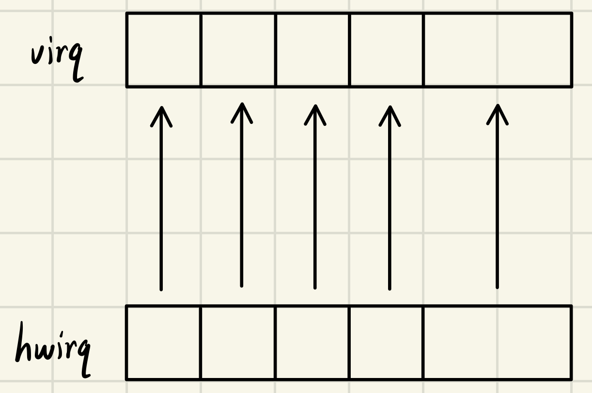

# 4 中断处理

中断处理过程中断处理对现代操作系统有着至关重要的作用，是多任务调度和人机高效交互的基础。操作系统的中断处理需要一个中断源，这个中断源就是硬件提供的，所以中断处理流程中硬件的处理流程也至关重要。由于涉及到硬件，不同架构会有不同的处理规范。在龙芯架构下，需要遵循龙芯中断处理的规范。所以本章将会首先介绍龙芯架构的例外与中断，然后介绍如何获取龙芯架构的中断信息，以及如何设置中断，这就涉及龙芯架构中与中断相关的寄存器。最后实现中断处理，并用一个简单的时钟中断测试中断处理。

### 4.1 龙芯架构的例外与中断概述

首先区分一下例外与中断，例外来自处理器内部，中断来自处理器外部。区分了不同点，也理解一下共同点：例外和中断都是中断源，都可以打断当前的执行流。由于它们有所共同点，所以它们的处理流程有共同的部分，但是又因为它们还是有所不同的，所以在处理流程中要加以区分。

龙芯定义的部分例外有如下内容，详情参阅龙芯架构手册7.4.5节的表7-8。下表和寄存器相关的内容有个印象即可，后续会详细介绍，可返回再看。

<table><thead><tr><th width="103" align="center">Ecode</th><th width="109">Esubcode</th><th width="125">例外代号</th><th>例外类型</th></tr></thead><tbody><tr><td align="center">0</td><td></td><td>INT</td><td>仅当 CSR.ECFG.VS=0 时，表示是中断</td></tr><tr><td align="center">1</td><td></td><td>PIL</td><td>load 操作页无效例外</td></tr><tr><td align="center">2</td><td></td><td>PIS</td><td>store 操作页无效例外</td></tr><tr><td align="center">8</td><td><ul><li>0</li><li>1</li></ul></td><td><ul><li>ADEF</li><li>ADEM</li></ul></td><td><ul><li>取址地址错例外</li><li>访存指令地址错例外</li></ul></td></tr></tbody></table>

中断来自处理器外部，中断信息需要传输到处理器内部，即传输到处理器内部的中断状态位。每个架构有自己不同的实现方式，但是底层逻辑大致都为这样。龙芯架构的中断被处理器硬件标记到指令上以后就被当作一种例外进行处理，因此中断处理遵循普通例外的一部分规则。

了解龙芯的例外与中断之后，介绍一下龙芯例外与中断相关的控制状态寄存器，然后介绍龙芯架构例外处理流程。中断处理流程较例外处理流程多了中断信息采集的步骤，这里中断信息的采集是站在处理器的角度看的。

#### 4.1.1 当前模式信息（CRMD）

该寄存器中的信息用于决定处理器核当前所处的特权等级、全局中断使能、监视点使能和地址翻译模式。

> 此处仅介绍和例外相关的内容。

<table><thead><tr><th width="97" align="center">位</th><th width="77" align="center">名字</th><th width="80" align="center">读写</th><th>描述</th></tr></thead><tbody><tr><td align="center">1:0</td><td align="center">PLV</td><td align="center">RW</td><td><p>当前特权等级。</p><p>当触发例外时，硬件将该域的值置为 0，以确保陷入后处于最高特权等级。</p><p>例外返回时，硬件将 CSR.PRMD 的 PPLV 域的值恢复到这里。</p><p>例外返回时，TLB重填例外、机器错误例外对该域的处理不同。</p></td></tr><tr><td align="center">2</td><td align="center">IE</td><td align="center">RW</td><td><p>当前全局中断使能，高有效。当触发例外时，硬件将该域的值置为 0，以确保陷入后屏蔽中断。例外处理程序决定重新开启中断响应时，需显式地将该位置 1。</p><p>例外返回时，硬件将 CSR.PRMD 的 PIE 域的值恢复到这里。</p><p>例外返回时，TLB重填例外、机器错误例外对该域的处理不同。</p></td></tr></tbody></table>

#### 4.1.2 例外前模式信息（PRMD）

当触发例外时，如果例外类型不是 TLB 重填例外和机器错误例外，硬件会将此时处理器核的特权等级、全局中断使能和监视点使能位保存至例外前模式信息寄存器中，用于例外返回时恢复处理器核的现场。

> 此处仅介绍和例外相关的内容。

<table><thead><tr><th width="97" align="center">位</th><th width="77" align="center">名字</th><th width="80" align="center">读写</th><th>描述</th></tr></thead><tbody><tr><td align="center">1:0</td><td align="center">PPLV</td><td align="center">RW</td><td>当触发例外时，如果例外类型不是 TLB 重填例外和机器错误例外，硬件会将 CSR.CRMD 中 PLV 域的旧值记录在这个域。</td></tr><tr><td align="center">2</td><td align="center">PIE</td><td align="center">RW</td><td>当触发例外时，如果例外类型不是 TLB 重填例外和机器错误例外，硬件会将 CSR.CRMD 中 IE 域的旧值记录在这个域。</td></tr></tbody></table>

#### 4.1.1 例外配置寄存器（ECFG）

该寄存器用于控制例外和中断的入口计算方式以及各中断的局部使能位。

<table><thead><tr><th width="97" align="center">位</th><th width="79" align="center">名字</th><th width="80" align="center">读写</th><th>描述</th></tr></thead><tbody><tr><td align="center">12:0</td><td align="center">LIE</td><td align="center">RW</td><td>局部中断使能位，高有效。这些局部中断使能位与 CSR.ESTAT 中 IS 域记录的 13 个中断源一一对应，每一位控制一个中断源。</td></tr><tr><td align="center">15:13</td><td align="center">0</td><td align="center">R0</td><td>保留域。读返回 0，且软件不允许改变其值。</td></tr><tr><td align="center">18:16</td><td align="center">VS</td><td align="center">RW</td><td>配置例外和中断入口的间距。当 <strong>VS=0</strong> 时，所有例外和中断的入口地址是同一个。当 <strong>VS!=0</strong> 时，各例外和中断之间的入口地址间距是 2^VS条指令。因为 TLB 重填例外和机器错误例外有独立的入口基址，所以二者的例外入口不受 VS 域的影响。</td></tr><tr><td align="center">31:19</td><td align="center">0</td><td align="center">R0</td><td>保留域。读返回 0，且软件不允许改变其值。</td></tr></tbody></table>

#### 4.1.2 例外状态（ESTAT）

<table><thead><tr><th width="97" align="center">位</th><th width="129" align="center">名字</th><th width="80" align="center">读写</th><th>描述</th></tr></thead><tbody><tr><td align="center">1:0</td><td align="center">IS[1:0]</td><td align="center">RW</td><td>两个软件中断的状态位。比特 0 和 1 分别对应 SWI0 和 SWI1。 软件中断的设置也是通过这两位完成，软件写 1 置中断写 0 清中断。</td></tr><tr><td align="center">12:2</td><td align="center">IS[12:2]</td><td align="center">R</td><td>中断状态位。其值为 1 表示对应的中断置起。1 个核间中断（IPI），1 个定时器中断（TI），1 个性能计数器溢出中断（PMI），8 个硬中断（HWI0~HWI7）在线中断模式下，硬件仅是逐拍采样各个中断源并将其状态记录与此。此时对于所有中断须为电平中断的要求，是由中断源负责保证，并不在此处维护。</td></tr><tr><td align="center">15:13</td><td align="center">0</td><td align="center">R0</td><td>保留域。读返回 0，且软件不允许改变其值。</td></tr><tr><td align="center">21:16</td><td align="center">Ecode</td><td align="center">R</td><td>例外类型<strong>一级编码</strong>。触发例外时：如果是 TLB 重填例外或机器错误例外，该域保持不变；否则，硬件会根据例外类型将龙芯架构参考手册表 7- 8 中 Ecode 栏定义的数值写入该域。</td></tr><tr><td align="center">30:22</td><td align="center">EsubCode</td><td align="center">R</td><td>例外类型<strong>二级编码</strong>。触发例外时：如果是 TLB 重填例外或机器错误例外，该域保持不变；否则，硬件会根据例外类型将龙芯架构参考手册表 7- 8 中 EsubCode 栏定义的数值写入该域。</td></tr><tr><td align="center">31</td><td align="center">0</td><td align="center">R0</td><td>保留域。读返回 0，且软件不允许改变其值。</td></tr></tbody></table>

#### 4.1.3 例外程序返回地址（ERA）

该寄存器记录普通例外处理完毕之后的返回地址。当触发例外时，如果例外类型既不是 TLB 重填例外也不是机器错误例外，则触发例外的指令的 PC 将被记录在该寄存器中。

<table><thead><tr><th width="131" align="center">位</th><th width="79" align="center">名字</th><th width="80" align="center">读写</th><th>描述</th></tr></thead><tbody><tr><td align="center">GRLEN-1:0</td><td align="center">PC</td><td align="center">RW</td><td><p>触发例外时：</p><p>如果是 TLB 重填例外或机器错误例外，该域保持不变；</p><p>否则，硬件会将触发例外的指令的 PC 记录到这里。对于 LA64 架构，在这种情况下，如果触发例外的特权等级处于 32 位地址模式，那么记录的 PC 值的高 32 位强制置为 0。</p></td></tr></tbody></table>

#### 4.1.4 例外入口地址（EENTRY）

该寄存器用于配置普通例外和中断的入口地址。

<table><thead><tr><th width="138" align="center">位</th><th width="79" align="center">名字</th><th width="80" align="center">读写</th><th>描述</th></tr></thead><tbody><tr><td align="center">11:0</td><td align="center">0</td><td align="center">R</td><td>只读恒为 0，写被忽略。</td></tr><tr><td align="center">GRLEN-1:12</td><td align="center">PC</td><td align="center">RW</td><td>普通例外和中断入口地址所在页的页号。</td></tr></tbody></table>

### 4.2 龙芯例外和中断处理流程

#### 4.2.1 例外处理流程

* 将 CSR.CRMD 的 PLV、IE 分别存到 CSR.PRMD 的 PPLV、PIE 中，然后将 CSR.CRMD 的 PLV 置为 0，IE 置为 0；
* 对于支持 Watch 功能的实现，还要将 CSR.CRMD 的 WE 存到 CSR.PRMD 的 PWE 中，然后将 CSR.CRMD 的 WE 置为 0；
* 将触发例外指令的 PC 值记录到 CSR.ERA 中；
* 跳转到例外入口处取指。

当软件执行 ERTN 指令从普通例外执行返回时，处理器硬件会完成如下操作：

* 将 CSR.PRMD 中的 PPLV、PIE 值恢复到 CSR.CRMD 的 PLV、IE 中；
* 对于支持 Watch 功能的实现，还要将 CSR.PRMD 中的 PWE 值恢复到 CSR.CRMD 的 WE 中；
* 跳转到 CSR.ERA 所记录的地址处取指。

#### 4.2.1 中断处理流程

各中断源发来的中断信号被处理器采样至 CSR.ESTAT.IS 域中，这些信息与软件配置在 CSR.ECFG.LIE 域中的局部中断使能信息按位与，得到一个 13 位中断向量 int\_vec。当 CSR.CRMD.IE=1 且 int\_vec 不为全 0 时，处理器认为有需要响应的中断，于是从执行的指令流中挑选出一条指令，将其标记上一种特殊的例外，即中断例外。随后处理器硬件的处理过程与普通例外的处理过程一样。

### 4.3 编写例外中断处理程序

#### 4.3.1 例外与中断初始化配置

```c
/* /* os-loongson/os-elephant-dev/kernel/irq.c */
void arch_init_irq(void)
{
        unsigned int ecfg = ( 0U << CSR_ECFG_VS_SHIFT ) | 0x3fcU | (0x1 << 11);
        unsigned long tcfg = 0x10000000UL | (1U << 0) | (1U << 1);

        clear_csr_ecfg(ECFG0_IM);
	clear_csr_estat(ESTATF_IP);

	write_csr_ecfg(ecfg);

	write_csr_tcfg(tcfg);
	write_csr_eentry((unsigned long)trap_entry);   // trap_entry为例外入口程序，见4.3.2
	arch_local_irq_enable();
}
```

此处还要添加访问有关系统控制寄存器的函数。

> 可参考仓库 ch4-3 分支的 include/loongarch.h 文件内容，依次实现 ecfg、estat、tcfg、eentry 系统控制寄存器的访问函数。

`arch_local_irq_enable()` 函数为打开中断响应。

```c
/* /* os-loongson/os-elephant-dev/kernel/irq.c */
static inline void arch_local_irq_enable(void)
{
	uint32_t flags = CSR_CRMD_IE;
	__asm__ __volatile__(
		"csrxchg %[val], %[mask], %[reg]\n\t"
		: [val] "+r" (flags)
		: [mask] "r" (CSR_CRMD_IE), [reg] "i" (LOONGARCH_CSR_CRMD)
		: "memory");
}
```

#### 4.3.2 例外入口程序

```c
/* os-loongson/os-elephant-dev/kernel/trap_entry.S */
.section .text
.globl trap_entry
.align 4
trap_entry:
        // 流出空间保存寄存器
        addi.d $sp, $sp, -256

        // 保存寄存器
        st.d $ra, $sp, 0
        st.d $tp, $sp, 8
        st.d $sp, $sp, 16
        st.d $a0, $sp, 24
        st.d $a1, $sp, 32
        st.d $a2, $sp, 40
        st.d $a3, $sp, 48
        st.d $a4, $sp, 56
        st.d $a5, $sp, 64
        st.d $a6, $sp, 72
        st.d $a7, $sp, 80
        st.d $t0, $sp, 88
        st.d $t1, $sp, 96
        st.d $t2, $sp, 104
        st.d $t3, $sp, 112
        st.d $t4, $sp, 120
        st.d $t5, $sp, 128
        st.d $t6, $sp, 136
        st.d $t7, $sp, 144
        st.d $t8, $sp, 152
        st.d $r21, $sp,160
        st.d $fp, $sp, 168
        st.d $s0, $sp, 176
        st.d $s1, $sp, 184
        st.d $s2, $sp, 192
        st.d $s3, $sp, 200
        st.d $s4, $sp, 208
        st.d $s5, $sp, 216
        st.d $s6, $sp, 224
        st.d $s7, $sp, 232
        st.d $s8, $sp, 240

	// 调用C例外处理程序
        bl trap_handler

        // restore register
        ld.d $ra, $sp, 0
        ld.d $tp, $sp, 8
        ld.d $sp, $sp, 16
        ld.d $a0, $sp, 24
        ld.d $a1, $sp, 32
        ld.d $a2, $sp, 40
        ld.d $a3, $sp, 48
        ld.d $a4, $sp, 56
        ld.d $a5, $sp, 64
        ld.d $a6, $sp, 72
        ld.d $a7, $sp, 80
        ld.d $t0, $sp, 88
        ld.d $t1, $sp, 96
        ld.d $t2, $sp, 104
        ld.d $t3, $sp, 112
        ld.d $t4, $sp, 120
        ld.d $t5, $sp, 128
        ld.d $t6, $sp, 136
        ld.d $t7, $sp, 144
        ld.d $t8, $sp, 152
        ld.d $r21, $sp,160
        ld.d $fp, $sp, 168
        ld.d $s0, $sp, 176
        ld.d $s1, $sp, 184
        ld.d $s2, $sp, 192
        ld.d $s3, $sp, 200
        ld.d $s4, $sp, 208
        ld.d $s5, $sp, 216
        ld.d $s6, $sp, 224
        ld.d $s7, $sp, 232
        ld.d $s8, $sp, 240

        addi.d $sp, $sp, 256

        // 例外返回
        ertn
```

#### 4.3.3 C例外处理程序

```c
/* os-loongson/os-elephant-dev/kernel/irq.c */
void trap_handler(void)
{
	unsigned int estat = read_csr_estat();
	unsigned int ecfg = read_csr_ecfg();
	unsigned long era = read_csr_era();
	unsigned long prmd = read_csr_prmd();

	if((prmd & CSR_PRMD_PPLV) != 0)
		put_str("kerneltrap: not from privilege0");
	if(intr_get() != 0)
		put_str("kerneltrap: interrupts enabled");

	if (estat & ecfg & (0x1 << 11)) {
		timer_interrupt();
	} else if (estat & ecfg) {
		printk("estat %x, ecfg %x\n", estat, ecfg);
		printk("era=%p eentry=%p\n", read_csr_era(), read_csr_eentry());
		while(1);
	}

	write_csr_era(era);
	write_csr_prmd(prmd);
}
```

其中 `timer_interrupt()` 实现了一个简单的时钟中断处理程序，用来测试中断处理。

```c
/* os-loongson/os-elephant-dev/kernel/irq.c */
void timer_interrupt(void)
{
	put_str("timer interrupt\n");
	/* ack */
	write_csr_ticlr(read_csr_ticlr() | (0x1 << 0));
}
```

最后在 `init_all` 函数中调用 `arch_init_irq` 函数初始化中断。

```c
/* os-loongson/os-elephant-dev/kernel/init.c */

#ifdef CONFIG_LOONGARCH64
extern void arch_init_irq(void);
#endif

void init_all()
{
	char str[] = "os-loongson";
	int a = 1, b = 16;
#ifdef CONFIG_LOONGARCH64
	serial_ns16550a_init(9600);
	put_str("hello os-loongson\n");
#endif
	put_str("init_all\n");
	printk("hello %s-%c%d.%d\n", str, 'v', 0, a);
	printk("init_all: 0x%x\n", b);
#ifndef CONFIG_LOONGARCH64
	idt_init();	     // 初始化中断
#else
	arch_init_irq();
#endif
	while(1);
	// mem_init();	     // 初始化内存管理系统
	// thread_init();    // 初始化线程相关结构
	// timer_init();     // 初始化PIT
	// console_init();   // 控制台初始化最好放在开中断之前
	// keyboard_init();  // 键盘初始化
	// tss_init();       // tss初始化
	// syscall_init();   // 初始化系统调用
	// intr_enable();    // 后面的ide_init需要打开中断
	// ide_init();	     // 初始化硬盘
	// filesys_init();   // 初始化文件系统
}
```

### 4.4 体系结构无关代码适配

目前已经完成了一个简单的例外与中断处理流程，接下来将其适配到os-elephant-dev上。os-elephant-dev的中断处理框架在`kernel/interrupt.c`文件中，参考该文件进行适配。

#### 4.4.1 中断处理框架

首先介绍一下x86架构os-elephant-dev的中断处理框架。在打开中断之前，会设置好中断描述符表。中断描述符表中的内容为各种门描述符，这里只介绍中断门。中断门描述符的结构如图4.1所示。

<figure><figcaption><p>图4.1 中断门描述符</p></figcaption></figure>

> 引用《操作系统-真相还原》图7-3

如图4.1所示，中断门描述符中保存有中断处理程序相对于目标代码段的偏移量，即中断处理程序的入口地址。选择子的内容这里展开讲述，知道选择子会对应一个内存区域即可。假设上图中保存的选择子最终会得到从0地址开始的内存区域，那么中断处理程序在目标段内的偏移量就是从0地址开始的偏移量。

中断描述符表也保存在系统内存中，由系统寄存器IDTR保存中断描述符表的地址。从硬件产生中断到执行中断处理程序的过程如图4.2所示。

<figure><figcaption><p>图4.2 中断处理过程</p></figcaption></figure>

> 引用《操作系统-真相还原》图7-7

如图4.2所示，当异常或中断发生后，会产生一个中断向量，通过中断向量到中断描述符表中得到相应的门描述符。门描述符中保存有中断处理程序的段选择子和偏移量，选择子对应的内存起始地址加上偏移量得到中断处理程序的入口程序地址。

通过上述说明，可以看出i386使用了向量的设计，当中断发生时通过一个中断向量号得到最终的中断处理程序入口。这里给这个向量号定一个名字：**硬件中断向量号（简称硬件中断号，hwirq）**。

> 这里笔者想表达一些系统设计时，关于中断处理的框架设计，首先引出硬件中断向量号（简称硬件中断号）。到这里先记下这个硬件中断号，后续会继续使用中断向量号（简称中断号）的说法。明确说明，虽然会继续使用中断号的说法，但是后续本节说的中断号如果是硬件中断号，会明确的写为硬件中断号，所以未写为硬件中断号的地方是与硬件中断号不同的。

本节需要的x86架构硬件知识就先说到这里，然后开始软件部分。

在开启某个中断之前，需要先将中断处理程序注册到系统中。具体到os-elephant-dev就是将中断处理程序注册到idt\_table函数指针数组中，即将中断处理程序函数指针写入到idt\_table中。

开启中断，然后在中断发生后，硬件通过**硬件中断号**找到相应的中断处理程序。在中断处理程序中保存需要保存的寄存器，然后开始中断处理。最后恢复寄存器，中断返回。

这里解析一下x86架构os-elephant-dev的处理处理流程。

```c
%macro VECTOR 2
section .text
intr%1entry:		 ; 每个中断处理程序都要压入中断向量号,所以一个中断类型一个中断处理程序，自己知道自己的中断向量号是多少

   %2				 ; 中断若有错误码会压在eip后面 
; 以下是保存上下文环境
   push ds
   push es
   push fs
   push gs
   pushad			 ; PUSHAD指令压入32位寄存器,其入栈顺序是: EAX,ECX,EDX,EBX,ESP,EBP,ESI,EDI

   ; 如果是从片上进入的中断,除了往从片上发送EOI外,还要往主片上发送EOI 
   mov al,0x20                   ; 中断结束命令EOI
   out 0xa0,al                   ; 向从片发送
   out 0x20,al                   ; 向主片发送

   push %1			 ; 不管idt_table中的目标程序是否需要参数,都一律压入中断向量号,调试时很方便
   call [idt_table + %1*4]       ; 调用idt_table中的C版本中断处理函数
   jmp intr_exit

section .data
   dd    intr%1entry	 ; 存储各个中断入口程序的地址，形成intr_entry_table数组
%endmacro

...
VECTOR 0x05,ZERO
VECTOR 0x06,ZERO
VECTOR 0x07,ZERO 
VECTOR 0x08,ERROR_CODE
VECTOR 0x09,ZERO
...
VECTOR 0x20,ZERO	;时钟中断对应的入口
VECTOR 0x21,ZERO	;键盘中断对应的入口
VECTOR 0x22,ZERO	;级联用的
VECTOR 0x23,ZERO	;串口2对应的入口
VECTOR 0x24,ZERO	;串口1对应的入口
VECTOR 0x25,ZERO	;并口2对应的入口
VECTOR 0x26,ZERO	;软盘对应的入口
VECTOR 0x27,ZERO	;并口1对应的入口
VECTOR 0x28,ZERO	;实时时钟对应的入口
VECTOR 0x29,ZERO	;重定向
VECTOR 0x2a,ZERO	;保留
VECTOR 0x2b,ZERO	;保留
VECTOR 0x2c,ZERO	;ps/2鼠标
VECTOR 0x2d,ZERO	;fpu浮点单元异常
VECTOR 0x2e,ZERO	;硬盘
VECTOR 0x2f,ZERO	;保留
```

解析一下上述中断处理程序。汇编语言中VECTOR定义了一个有两个参数的宏，第一个参数是中断向量号，第二个参数是是否向栈中压入一个0（若为ZERO，则向栈中压入一个0；若为ERROR\_CODE，则执行一个NOP操作）。此处存在不同是因为有的异常处理中，硬件会自动向栈中压入一个错误码。为了栈格式的统一，在硬件未压错误码的情况下，使用软件压入一个0。

每使用一个VECTOR宏就是定义一个中断处理程序，接下来解析一下每个中断处理程序。这里留下一个伏笔，注意**中断号**。首先保存中断上下文：

```c
   %2				 ; 中断若有错误码会压在eip后面，ZERO情况下，%2 -> push 0
; 以下是保存上下文环境
   push ds
   push es
   push fs
   push gs
   pushad
```

向8259A中断芯片发送中断结束命令EOI信号：

```c
; 如果是从片上进入的中断,除了往从片上发送EOI外,还要往主片上发送EOI 
   mov al,0x20                   ; 中断结束命令EOI
   out 0xa0,al                   ; 向从片发送
   out 0x20,al                   ; 向主片发送
```

向栈中保存中断号，然后根据中断号跳转到C语言编写的体系结构无关代码处运行后续的中断处理，即调用idt\_table中保存的相应C语言中断处理程序：

```
   push %1			 ; 不管idt_table中的目标程序是否需要参数,都一律压入中断向量号,调试时很方便
   call [idt_table + %1*4]       ; 调用idt_table中的C版本中断处理函数
```

执行完C语言中断处理程序之后，恢复中断上下文，中断返回，intr\_exit为中断返回代码的起始地址：

```c
   jmp intr_exit
```

这段代码可以称为中断处理入口程序，入口程序就讲到这里。然后解析一下idt\_table函数指针数组，这个函数指针数组记录有中断号对应的中断处理程序。假设该数组已经经过初始化。

```c
/* kernel/interrupt.h */
typedef void (*intr_handler)(uint8_t vec_nr);
```

```c
/* kernel/interrupt.c */
intr_handler idt_table[IDT_DESC_CNT];
```

i386架构下，函数指针为32位，也就是4字节。所以通过这样的`call [idt_table + %1*4]`调用方式就能够跳转到中断号对应的中断处理程序。x86架构os-elephant-dev的中断处理流程就讲到这里，接下来开始笔者的内容。

首先注意到VECTOR宏的第一个参数，与中断处理入口程序中执行相应的idt\_table数组索引是对应的。这里给VECTOR第一个参数，也是idt\_table函数指针数组的索引（更重要的是idt\_table数组的索引）定一个名字：**虚拟中断向量号（简称虚拟中断号，virq）**。

在前面我们已经定了**硬件中断号**，**硬件中断号**和**虚拟中断号**之间存在一个映射关系，上述处理过程中，他们的映射关系是相等的映射关系。在这个映射的过程中完成了硬件到软件的过渡。在映射之前，要更多注意硬件的处理流程；在映射之后，要更多的注意软件的处理流程。在目前的大多数操作系统中都有一个中断入口的设计，这个入口完成了硬件到软件的过渡，入口中对体系结构无关代码的索引完成了硬件中断处理到软件中断处理的映射，即**硬件中断号**到**虚拟中断号**的映射。

我们用一个中断来走一遍上述内容，选用时钟中断。因为在CPU执行流之外有信息要传递到CPU，为了打断CPU执行流，使用中断来完成这个工作。现在时钟部件因为到时产生一个信号，并将该信号传递到中断控制器。计算机系统要运行起来需要系统中的各个部件协调统一的共同工作，需要协调因为他们之间是相互独立的，但为了组成一个系统，他们之间需要统一起来。控制器完成了翻译工作的同时也实现了各个部件的协调统一。此时中断控制器收到时钟部件传递来的信号，将其转换为CPU能够识别的中断信号。中断信号中需要包涵很多信息，其中就包含硬件中断号信息。将中断信号发送给CPU后，CPU就需要打断当前的执行流。CPU打断当前的执行流后，获得了时钟的硬件中断号，然后CPU通过硬件中断号找到时钟的中断处理入口程序，在中断处理入口程序中完成硬件中断号到虚拟机中断号的翻译，然后通过虚拟中断号找到系统配置的时钟中断处理程序。为协调统一，CPU也需要通知中断控制器，即发送完成中断的信号。所以在处理过程中找一个时机，向中断控制器发送一个信号。中断处理程序执行完之后，返回到CPU之前的执行流继续执行，回到发生中断前的状态。

有了硬件中断号、虚拟中断号以及硬件中断号和虚拟中断号之间的映射，系统设计时就可以考虑如何管理硬件中断号和虚拟中断号及其映射。其中硬件中断号是和硬件之间的约定，通过硬件获得。获得硬件中断号后，将其与一个虚拟中断号进行映射，得到一个虚拟中断号。得到虚拟中断号后，虚拟中断号对应一个中断处理程序。通过这个流程，中断处理程序的设置就更加自由了，不用再与硬件强相关。

到这里笔者想讲的已经讲完了，通过图4.4将上述内容表达出来。

<figure><figcaption><p>图4.3</p></figcaption></figure>

图4.3是硬件中断号和虚拟中断号相等映射的关系，这和上述处理流程中是一样的映射关系。然后根据图4.3，得到图4.4。

<figure><figcaption><p>图4.4</p></figcaption></figure>

图4.4的左边是将hwirq和virq作为两个集合，他们之间存在映射关系，映射函数为：

$$
virq = f(hwirq)
$$

图4.4的右边是将左边具体到与上述处理流程中相同的集合和映射关系，映射函数为：

$$
virq = f(hwirq) = hwirq
$$

根据这些，如果愿意，可以把映射关系变为这样：

$$
virq = f(hwirq) = hwirq * 2
$$

映射关系变成这样时，在代码中体现为（伪代码）：

```c
call [idt_table + %1 * 2 * 4]   //初始化时也要按这个映射关系进行初始化
```

还可以更复杂：

$$
virq = f(hwirq) = hash(hwirq)
$$

然后在代码中用一个哈希表来管理虚拟中断号的分配。

再说一句，笔者认为：映射函数本身是什么函数不是最重要的，重要的是那两个集合和他们之间的映射关系。希望上述内容能够有助于理解中断处理的框架。暂时就说这么多，本节上述内容不影响后续内容，如果有什么地方存在纰漏或错误，欢迎指正。

#### 4.4.2 代码适配

在`kernel/interrupt.h`文件中添加`arch_init_irq()`函数的声明。

```c
/* kernel/interrupt.h */
#ifndef CONFIG_LOONGARCH64
void idt_init(void);
#else
void arch_init_irq(void);
#endif
```

在`kernel/irq.c`文件中包含`kernel/interrupt.h`文件。使用一个宏定义最多支持多少个例外与中断。定义一个函数指针数组，用来存储中断处理程序。定义一个字符指针数组，用来存储中断名。

```c
/* kernel/irq.c */
#include "interrupt.h"

#define INTR_NUM	256

intr_handler intr_table[INTR_NUM];
char *intr_name[INTR_NUM];
```

定义通用中断处理函数和初始化所有例外函数，并在arch\_init\_irq()函数中调用初始化函数。

```c
/* kernel/irq.c */
static void general_intr_handler(uint8_t vec_nr)
{
	printk("!!!!!!!      excetion message begin  !!!!!!!!\n");
	printk("intr_table[%d]: %s happened", intr_name[vec_nr]);
	printk("\n!!!!!!!      excetion message end    !!!!!!!!\n");
	while(1);
}

static void exception_init(void)
{
	int i;
	for (i = 0; i < INTR_NUM; i++) {
		intr_name[i] = "unknown";
		intr_table[i] = general_intr_handler;
	}
}
```

```c
/* kernel/irq.c */
void arch_init_irq(void)
{
        unsigned int ecfg = ( 0U << CSR_ECFG_VS_SHIFT ) | 0x3fcU | (0x1 << 11);
        unsigned long tcfg = 0x10000000UL | (1U << 0) | (1U << 1);

        clear_csr_ecfg(ECFG0_IM);
	clear_csr_estat(ESTATF_IP);

	write_csr_ecfg(ecfg);
	write_csr_eentry((unsigned long)trap_entry);

	write_csr_tcfg(tcfg);

	exception_init();

	printk("arch_init_irq done\n");
}
```

编写获取中断状态函数、修改打开中断函数和关闭中断函数：

```c
/* kernel/irq.c */
enum intr_status intr_get_status(void)
{
	uint64_t crmd;

	crmd = read_csr_crmd();

	return (crmd & CSR_CRMD_IE) ? INTR_ON : INTR_OFF;
}

static inline void arch_local_irq_enable(void)
{
	uint32_t val = CSR_CRMD_IE;
	__asm__ __volatile__(
		"csrxchg %[val], %[mask], %[reg]\n\t"
		: [val] "+r" (val)
		: [mask] "r" (CSR_CRMD_IE), [reg] "i" (LOONGARCH_CSR_CRMD)
		: "memory");
}

static inline void arch_local_irq_disable(void)
{
	uint32_t val = 0;
	__asm__ __volatile__(
		"csrxchg %[val], %[mask], %[reg]\n\t"
		: [val] "+r" (val)
		: [mask] "r" (CSR_CRMD_IE), [reg] "i" (LOONGARCH_CSR_CRMD)
		: "memory");
}
```

仿照x86架构os-elephant-dev编写intr\_enable()函数、intr\_disable()和intr\_set\_status()函数：

```c
/* kernel/irq.c */

/* 开中断并返回开中断前的状态*/
enum intr_status intr_enable(void)
{
	enum intr_status old_status;

	if (intr_get_status() == INTR_ON) {
		old_status = INTR_ON;
	} else {
		old_status = INTR_OFF;
		arch_local_irq_enable();
	}

	return old_status;
}

/* 关中断并返回关中断前的状态 */
enum intr_status intr_disable(void)
{
	enum intr_status old_status;

	if (intr_get_status() == INTR_ON) {
		old_status = INTR_ON;
		arch_local_irq_disable();
	} else {
		old_status = INTR_OFF;
	}

	return old_status;
}

/* 将中断状态设置为status */
enum intr_status intr_set_status(enum intr_status status)
{
	return status & INTR_ON ? intr_enable() : intr_disable();
}
```

编写中断处理注册函数和执行中断处理函数：

```c
/* kernel/irq.c */
void register_handler(uint8_t vector_no, intr_handler function)
{
	intr_table[vector_no] = function;
}

void do_irq(uint64_t irq)
{
	intr_table[irq](irq);
}
```

修改trap\_handler()函数：

```c
/* kernel/irq.c */
void trap_handler(void)
{
	unsigned int estat = read_csr_estat();
	unsigned int ecfg = read_csr_ecfg();
	unsigned long era = read_csr_era();
	unsigned long prmd = read_csr_prmd();
	unsigned long irq;

	if((prmd & CSR_PRMD_PPLV) != 0)
		put_str("kerneltrap: not from privilege0");
	if(intr_get() != 0)
		put_str("kerneltrap: interrupts enabled");

	if (estat & ecfg & (0x1 << 11)) {
		irq = 64 + 11;
		// timer_interrupt();
	} else if (estat & ecfg) {
		printk("estat %x, ecfg %x\n", estat, ecfg);
		printk("era=%p eentry=%p\n", read_csr_era(), read_csr_eentry());
		while(1);
	}

	do_irq(irq);

	write_csr_era(era);
	write_csr_prmd(prmd);
}
```

重新编写一下时钟中断处理程序：

```c
/* kernel/irq.c */
void timer_interrupt(uint8_t vec_nr)
{
	printk("intr_table[%d]: timer interrupt\n", vec_nr);
	/* ack */
	write_csr_ticlr(read_csr_ticlr() | (0x1 << 0));
}
```

在arch\_init\_irq()函数中使用register\_handler()函数注册时钟中断处理函数：

```c
/* kernel/irq.c */
void arch_init_irq(void)
{
        unsigned int ecfg = ( 0U << CSR_ECFG_VS_SHIFT ) | 0x3fcU | (0x1 << 11);
        unsigned long tcfg = 0x10000000UL | (1U << 0) | (1U << 1);

        clear_csr_ecfg(ECFG0_IM);
	clear_csr_estat(ESTATF_IP);

	write_csr_ecfg(ecfg);
	write_csr_eentry((unsigned long)trap_entry);

	write_csr_tcfg(tcfg);

	exception_init();
	register_handler(64 + 11, timer_interrupt);

	printk("arch_init_irq done\n");
}
```

在`kernel/init.c`文件中的`init()`函数打开中断：

```c
/* kernel/init.c */
#include "interrupt.h"

void init_all()
{
	char str[] = "os-loongson";
	int a = 1, b = 16;
#ifdef CONFIG_LOONGARCH64
	serial_ns16550a_init(9600);
	put_str("hello os-loongson\n");
#endif
	put_str("init_all\n");
	printk("hello %s-%c%d.%d\n", str, 'v', 0, a);
	printk("init_all: 0x%x\n", b);
#ifndef CONFIG_LOONGARCH64
	idt_init();	     // 初始化中断
#else
	arch_init_irq();
	intr_enable();
#endif
	while(1);
	// mem_init();	     // 初始化内存管理系统
	// thread_init();    // 初始化线程相关结构
	// timer_init();     // 初始化PIT
	// console_init();   // 控制台初始化最好放在开中断之前
	// keyboard_init();  // 键盘初始化
	// tss_init();       // tss初始化
	// syscall_init();   // 初始化系统调用
	// intr_enable();    // 后面的ide_init需要打开中断
	// ide_init();	     // 初始化硬盘
	// filesys_init();   // 初始化文件系统
}
```
