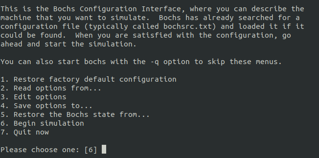
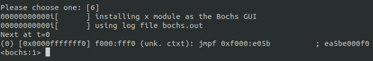
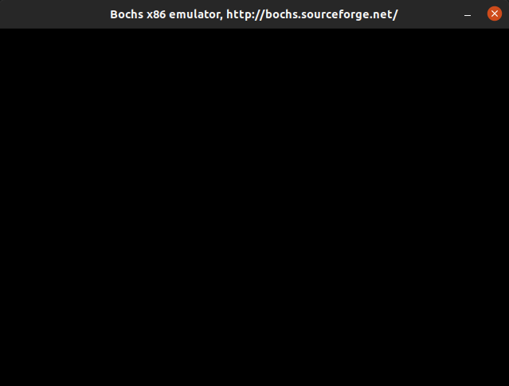
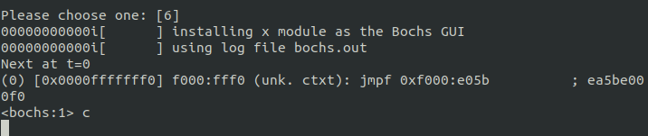

# 1 准备工作

### 前言

本教程用于学习龙芯架构，并进行编程实践。所说的龙芯架构包含了 loongarch 架构，以及龙芯硬件与系统之间的规范。讲述方式是将 os-elephant-dev 操作系统移植到龙芯架构上，在移植的过程中逐渐深入理解龙芯架构。选用的操作系统是比较容易上手的操作系统，其使用C语言完成开发，并有配套的书籍详细描述细节。所以移植过程中涉及到架构相关的内容会展开进行讲述，系统相关的内容会大致进行描述，在系统相关代码不影响理解的情况下深入理解龙芯架构。

本教程在 ubuntu20.04 系统下，选用 QEMU 模拟龙芯硬件环境进行开发，模拟的CPU型号为 3A5000。提到 loongarch 和 3A5000 可能会有点迷惑，所以先介绍一下 loongarch 和 3A5000，这样能够先大致了解龙芯。在介绍完 loongarch 和 3A5000 后再简单介绍一下 os-elephant-dev 操作系统，并在 bochs 模拟器中运行 x86 架构的 os-elephant-dev，对 os-elephant-dev 有一个简单的认识。

### 1.1 LoongArch 及龙芯 3A5000 处理器简介

LoongArch 指令集是一种精简指令集计算机风格的指令集架构，为龙芯自研指令集，不同于现存的任何一种指令集架构。LoongArch 指令集架构分为 32 位和 64 位两个版本，分别称为 LA32 架构和 LA64 架构。LA64 架构应用级向下二进制兼容 LA32 架构，即采用 LA32 架构的**应用软件二进制**可以直接运行在兼容 LA64 架构的机器上并获得相同的运行结果。

Loongson（即龙芯）是一个处理器家族，龙芯处理器主要包括三个系列，龙芯 1 号系列处理器、龙芯 2 号系列处理器和龙芯 3 号系列处理器。龙芯 3A5000 处理器属于龙芯系列处理器中的龙芯 3 号系列处理器。龙芯 3 号系列处理器片内集成多个 64 位处理器核以及必要的存储和 IO 接口，面向高端嵌入式计算机、桌面、服务器等应用。截至目前为止龙芯 3 号中：龙芯 3A1000、龙芯 3B1500 、龙芯 3A2000、龙芯 3A3000、龙芯 3A4000 都是兼容 MIPS 的龙芯处理器，而龙芯 3A5000（以及将来的型号）是基于 LoongArch 指令集架构的龙芯处理器。

关于 Loongarch 和龙芯 3A5000 先介绍到这里。通过本节的介绍，对 Loongarch 指令集架构和龙芯处理器家族有了概念，教程后面会对龙芯架构的细节展开讲述。在开始讲述龙芯相关的内容之前，首先介绍一下要使用的 os-elephant-dev 操作系统。

### 1.2 os-elephant-dev 简介

os-elephant-dev 是《操作系统-真相还原》配套的操作系统，该书详细描述了如何实现该操作系统。该系统实现了中断、内存管理、线程、用户进程、磁盘驱动、文件系统和一些系统调用，包含了操作系统中的各个模块。接下来运行一下 os-elephant-dev 操作系统，**本节的作用是建立项目的目录基本结构，并且对系统有个大致认识**。

x86 架构的 os-elephant-dev 能运行起来就行了，为了尽量不修改系统相关代码，也为了不影响本教程的进度，所以使用与原书相同的环境运行，即 bochs 运行 x86 架构的 os-elephant-dev 操作系统。建议仔细阅读本节后续内容，与本教程的环境配置相同，尽量不在配置上花费太多精力。下面开始配置 x86 架构 os-elephant-dev 的运行环境。

下载 os-loongson 项目，其中包含 os-elephant-dev 操作系统，下载完成后，切换到本节对应的分支，然后进入 os-loongson 中：

```bash
git clone https://github.com/huloves/os-loongson
cd os-loongson/
os-loongson$ git checkout ch1-2
```

> 当前工作目录：os-loongson/，上面命令行中出现的 os-loongson$ 表示工作目录，注意仅复制工作目录后的命令部分。后面出现类似的内容皆为当前工作目录。

进入到项目工作目录后，开始安装 bochs，首先安装 bochs 可能依赖的库文件：

```bash
os-loongson$ sudo apt install build-essential
os-loongson$ sudo apt-get install libghc-x11-dev
os-loongson$ sudo apt-get install xorg-dev
```

下载 bochs，并解压到 os-loongson 目录中，然后在 os-loongson 目录中创建 bochs/ 目录，该 bochs 目录将作为安装 bochs 时的目标目录，安装的文件会安装在该目录中。创建 bochs/ 目录完成之后使用 ls 命令查看当前工作目录中的内容：

```bash
os-loongson$ wget https://udomain.dl.sourceforge.net/project/bochs/bochs/2.6.8/bochs-2.6.8.tar.gz
os-loongson$ tar -xvf bochs-2.6.8.tar.gz
os-loongson$ mkdir bochs
os-loongson$ ls
bochs-2.6.8.tar.gz  bochs-2.6.8  bochs  os-elephant-dev README.md
```

解压完成后，进入 bochs 源码目录，进行配置、编译、安装。安装的目标目录在配置的时候由 --prefix 参数指定，**注意 prefix 中写成自己创建的 bochs 目录绝对路径，此处仅给出示例**。编译过程中可能会出现未安装的依赖库文件，一般安装后即可。

```bash
os-loongson$ cd bochs-2.6.8.tar.gz
os-loongson/bochs$ ./configure --prefix=/home/huloves/repositories/os-loongson/bochs --enable-debugger --enable-disasm --enable-iodebug --enable-x86-debugger --with-x --with-x11 LDFLAGS='-pthread'
os-loongson/bochs$ make
os-loongson/bochs$ make install
```

到这里 bochs 就安装完成了，之后进入安装的目标目录中，即 `os-loongson/bochs` 中配置运行 x86 架构 os-elephant-dev 操作系统所需要的配置文件。需要的配置文件这里下面都会列出来，依然为了不影响本教程的进度，配置文件将会直接给出可以使用的链接，点击文件名即可下载。

* [hd60M.img](https://github.com/Qiubomm-OS/toolchains/releases/download/v0.1/hd60M.img) - 未分区虚拟磁盘，编译出的 x86 架构 os-elephant-dev 内核会写录入该文件
* [hd80M.img](https://github.com/Qiubomm-OS/toolchains/releases/download/v0.1/hd80M.img) - 已分区，用于文件系统
* [bochsrc.disk](https://github.com/Qiubomm-OS/toolchains/releases/download/v0.1/bochsrc.disk) - 该文件下载下来后注意其内容中，有关路径的部分替换为自己环境下的路径

下载完成后将下载的文件放到 `os-loongson/bochs` 目录下。此时在 `os-loongson/bochs` 目录下使用 ls 命令查看文件，显示如下：

```bash
os-loongson/bochs$ ls
bin  bochsrc.disk  hd60M.img  hd80M.img  share
```

到这里 x86 架构 os-elephant-dev 的运行环境就配置完成了。下面开始编译 x86 架构 os-elephant-dev 代码并运行。

首先进入 `os-loongson/os-elephant-dev/` 目录中。找到 makefile 文件中 hd 目标的内容，并将其后面的命令修改为自己环境下的路径。这里给出示例：

```makefile
hd:
	dd if=$(BUILD_DIR)/mbr.bin of=/home/huloves/repositories/os-loongson/bochs/hd60M.img bs=512 count=1  conv=notrunc
	dd if=$(BUILD_DIR)/loader.bin of=/home/huloves/repositories/os-loongson/bochs/hd60M.img bs=512 count=4 seek=2 conv=notrunc
	dd if=$(BUILD_DIR)/kernel.bin of=/home/huloves/repositories/os-loongson/bochs/hd60M.img bs=512 count=200 seek=9 conv=notrunc
```

然后在 `os-loongson/os-elephant-dev/` 目录执行下述命令编译链接，并写入到虚拟磁盘中：

```bash
os-loongson/os-elephant-dev$ make all
```

进入 os-loongson/bochs 目录，执行下述命令运行 x86 架构的 os-elephant-dev 操作系统：

```bash
os-loongson/bochs$ ./bin/bochs -f bochsrc.disk
```

执行成功的话会显示如下界面：

<figure><figcaption><p>图 1.2.1 bochs 运行界面展示 1</p></figcaption></figure>

到这里按下回车默认执行第六个选项，显示如下图所示的界面，并伴随一个如下图所示的黑框：

<figure><figcaption><p>图 1.2.2 bochs 运行界面展示 2</p></figcaption></figure>

<figure><figcaption><p>图 1.2.3 bochs 运行界面展示 3</p></figcaption></figure>

然后输入c，并按下回车开始运行，运行截图如下所示：

<figure><figcaption><p>图 1.2.4 bochs 运行界面展示 4</p></figcaption></figure>

<figure><figcaption><p>图 1.2.4 bochs 运行界面展示 5</p></figcaption></figure>

到这里 x86 架构 os-elephant-dev 的试运行就结束了，如图 1.2.5 所示，画面出现一个 shell，并且运行了几个命令。为了能够轻松的支持 shell 并运行图 1.2.5 所示的命令，操作系统做了很多系统支持。操作系统操作系统的运行需要底层硬件的支持，不过目前运行的 os-elephant-dev 是 x86 架构的，之后会逐渐将 os-elephant-dev 移植到 loongarch 架构上。

此处做一个小节，到目前为止我们知道了 loongarch 和龙芯系列处理器，以及 loongarch 和龙芯系列处理器之间的关系。在龙芯系列处理器中，我们将会使用龙芯 3A5000 处理器。我们还通过试运行 x86 架构的os-elephant-dev 操作系统建立了项目的目录基本机构，以及通过试运行知道我们将来在龙芯 3A5000 处理器上运行后会出现什么样的结果。

接下来开始龙芯相关工作，首先我们要明确 loongarch 架构不同于 x86 架构。本教程使用的计算机是 x86 架构的，并且使用的 ubuntu 操作系统也是 x86 架构的。在这样的环境下需要考虑如下几点：

* 想要在 x86 架构的计算机上运行 loongarch 架构的操作系统，需要支持 loongarch 架构的虚拟机；
* 想要最后生成 loongarch 架构的二进制文件，需要支持 loongarch 架构的交叉编译器；
* 将来可能会用到了调试工具，所以也需要支持 loongarch 架构的 gdb 调试工具。

我们将这里提到的工具称为龙芯开发环境，接下来开始配置龙芯开发环境。

### 1.3 配置龙芯开发环境

龙芯开发环境包含：需要支持 loongarch 架构的虚拟机、需要支持 loongarch 架构的交叉编译器和需要支持 loongarch 架构的 gdb 调试工具。这些工具分别是：

* qemu-system-loongarch64 - 需要支持 loongarch 架构的虚拟机；
* loongarch64-unknown-linux-gnu-gcc 等交叉工具链 - 需要支持 loongarch 架构的交叉编译器；
* 支持 loongarch 架构的 gdb 调试工具 - 需要支持 loongarch 架构的 gdb 调试工具

#### 1.3.1 配置qemu运行环境

在 os-loongson 中创建 qemu 目录，其中放置需要使用的 QEMU。

> QEMU是一个通用的开源机器模拟器和虚拟器。[QEMU Main Documentation](https://www.qemu.org/docs/master/)

开始搭建 loongarch 架构的 qemu 运行环境。

下载[qemu-system-loongarch64](https://github.com/Qiubomm-OS/toolchains/releases/download/v0.1/qemu-system-loongarch64)、[loongarch\_bios\_0310\_debug.bin](https://github.com/Qiubomm-OS/toolchains/releases/download/v0.1/loongarch\_bios\_0310\_debug.bin)和[efi-virtio.rom](https://github.com/Qiubomm-OS/toolchains/releases/download/v0.1/efi-virtio.rom)到os-loongson/qemu中。

在 `os-loongson/qemu/` 目录下使用下述命令试运行：

```bash
os-loongson$ cd qemu
os-loongson/qemu$ ./qemu-system-loongarch64 -m 4G -smp 1 -bios ./loongarch_bios_0310_debug.bin -vga none -nographic
```

> efi-virtio.rom - qemu需要使用的rom file。
>
> loongarch\_bios\_0310\_debug.bin. loongarch架构UEFI bios二进制程序。

#### 1.3.2 下载编译工具链

在os-loongson中创建toolchains目录，其中放置需要用到的工具链。

下载工具链包 [loongarch64-clfs-6.3-cross-tools-gcc-full.tar.xz](https://github.com/Qiubomm-OS/toolchains/releases/download/v0.1/loongarch64-clfs-6.3-cross-tools-gcc-full.tar.xz) 到os-loongson下，并解压到os-loongson/toolchains中，解压命令如下：

```bash
os-loongson$ tar -xvf loongarch64-clfs-6.3-cross-tools-gcc-full.tar.xz -C toolchains
```

#### 1.3.3 下载支持 loongarch 架构的 gdb 调试工具

进入 os-loongson/ 目录执行下述命令：

```bash
os-loongson$ git clone https://github.com/loongson/binutils-gdb.git
os-loongson$ mkdir toolchains/gdb-loongarch
os-loongson$ cd binutils-gdb/
os-loongson/binutils-gdb$ ./configure --prefix=/home/huloves/repositories/os-loongson/toolchains/gdb-loongarch/ --host=x86_64-pc-linux-gnu --target=loongarch64-unknown-linux-gnu  --disable-binutils --disable-ld --disable-gold --disable-gas --disable-sim --disable-gprof
os-loongson/binutils-gdb$ make
os-loongson/binutils-gdb$ make install
```
